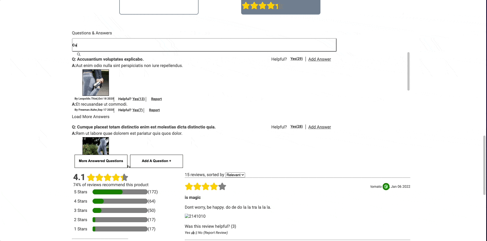

# Project Catwalk

        

# Summary
Project Catwalk is a client-facing, e-commerce web app built to display products and related information across various modules (Product Overivew, Related Products, Questions & Answers, Ratings & Reviews).

# Product Overview & Related Items
<p>
  
</p>

# Questions & Answers and Ratings & Reviews
<p>
  
</p>

# Product Overview

# Related Products

# Questions & Answers
The Questions & Answers module is the user's access point to questions and answers asked by other users about a product. Via the Questions & Answers module the user can search for specific questions, report a question and/or answer, mark a question as helpful, and submit questions and/or answers about a particular product. Taking user experience into consideration, we've kept all questions and answers contained in their respective accordions in order to accommodate a user-friendly experience.

# Ratings & Reviews
Rating and Reviews widget houses the displayed product rating breakdown and the reviews related to the product.  On page load a call will be made to an api server to grab the necessary data to render out the two sections.  Everything is dynamically rendered based off of the displayed products id.  Contains components to add a review and sort the returned reviews.

# Quick Start
*Don't work out of main branch*
1. Clone the repository to your local machine
2. Run npm install
3. Create a branch
> `git checkout branch <your-branch-name>`
4. Create a config.js file
5. Add your access token and imgbb token to config.js
```
let TOKEN = 'YOUR_TOKEN_HERE';
exports.TOKEN = TOKEN;
exports.imgbb = 'YOUR_TOKEN_HERE';
```
4. Run npm run watch *starts webpack in watch mode*
5. Run npm start *runs nodemon on the server*
